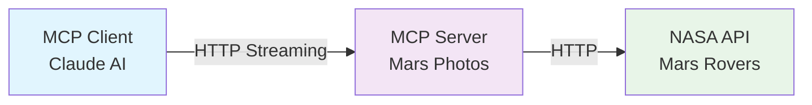

# MCP .NET Demo - Mars Photos API

A complete demonstration of the Model Context Protocol (MCP) using .NET, featuring a Mars Photos API server and an interactive AI client. This project provides a simple example of how to build MCP servers and clients in .NET.

## 🚀 Overview

This solution demonstrates a simple implementation of MCP (Model Context Protocol) using .NET 9.0, featuring:

- **MCP Server**: A Mars Photos API server that provides tools to query NASA's Mars rover data
- **MCP Client**: An interactive console application that connects to Claude AI for natural language queries
- **Streaming HTTP Transport**: Primary transport for client-server communication
- **AI Integration**: Anthropic Claude AI for intelligent photo queries

## 🏗️ Architecture



### Transport Options

1. **Streaming HTTP Transport** (Primary)

   - Used when running the `mcp-simple-client` project
   - Enables real-time communication between client and server
   - Supports streaming responses for better user experience

2. **Stdio Transport** (Alternative)

   - Used when running the MCP server from external clients like Claude Desktop or VS Code
   - Standard MCP transport for tool integration

### Components

1. **MCP Server** (`mcp-simple-server/`)

   - Implements Mars Photos API tools
   - Provides `get-current-date` and photo query capabilities
   - Handles NASA API communication
   - Supports both HTTP and stdio transports

2. **MCP Client** (`mcp-simple-client/`)

   - Interactive console interface
   - Integrates with Claude AI via Anthropic SDK
   - Features conversation history and system prompt control
   - Demonstrates different MCP interaction modes
   - Uses streaming HTTP transport for real-time communication

## 🛠️ Technologies Used

- **.NET 9.0** - Modern .NET framework
- **Model Context Protocol** - AI tool integration standard
- **Anthropic Claude AI** - Natural language processing
- **NASA Mars Photos API** - Real Mars rover data
- **Microsoft.Extensions.AI** - AI integration libraries
- **HTTP Streaming** - Real-time client-server communication

## 📁 Project Structure

```
1-simple/
├── README.md                    # This file
├── mcp-simple.sln              # Solution file
├── mcp-simple-server/          # MCP Server implementation
│   ├── README.md               # Server setup and documentation
│   ├── Program.cs              # Server entry point
│   ├── MarsPhotosTools.cs      # MCP tools implementation
│   └── NasaApiConfiguration.cs # NASA API configuration
└── mcp-simple-client/          # MCP Client implementation
    ├── README.md               # Client setup and documentation
    ├── Program.cs              # Client entry point
    └── mcp-simple-client.csproj # Client project file
```

## 🚀 Quick Start

### Prerequisites

- .NET 9.0 SDK
- Anthropic API key (for Claude AI access)
- Internet connection (for NASA API access)

### Setup Instructions

1. **Clone and Build**

   ```bash
   git clone <repository-url>
   cd 1-simple
   dotnet build
   ```

2. **Configure API Keys**

   ```bash
   # Set Anthropic API key for the client
   cd mcp-simple-client
   dotnet user-secrets set "ANTHROPIC_API_KEY" "your-api-key-here"
   ```

3. **Run the Demo**

   ```bash
   # Start the client (it will automatically start the server)
   cd mcp-simple-client
   dotnet run
   ```

## 📖 Detailed Documentation

### Server Setup

For detailed server setup, configuration, and API documentation, see:
**[mcp-simple-server/README.md](mcp-simple-server/README.md)**

### Client Setup

For client configuration, interactive menu system, and usage examples, see:
**[mcp-simple-client/README.md](mcp-simple-client/README.md)**

## 🎯 Demo Features

### Interactive Menu System

- Choose between conversation history modes
- Toggle system prompt for date tool instructions
- Custom configuration options

### Mars Photos Queries

- Query photos by rover, date, and camera
- Real-time date resolution for relative queries
- Detailed photo information and metadata

### AI Integration

- Natural language processing with Claude
- Context-aware conversations
- Intelligent tool selection

### Streaming Communication

- Real-time response streaming
- Immediate feedback during AI processing
- Enhanced user experience

## 🔧 Development

### Building from Source

```bash
# Build the entire solution
dotnet build

# Build individual projects
dotnet build mcp-simple-server
dotnet build mcp-simple-client
```

### Debugging

- Open the solution in Visual Studio
- Set `mcp-simple-client` as the startup project
- Press F5 to debug

## 🌟 Key Learning Outcomes

This demo demonstrates:

1. **MCP Server Implementation**

   - Tool definition and implementation
   - API integration patterns
   - Error handling and validation

2. **MCP Client Implementation**

   - Client-server communication
   - AI integration patterns
   - User experience design

3. **Real-world MCP Usage**

   - Practical tool development
   - Natural language processing
   - Context management

## 🤝 Contributing

This is a demonstration project. For contributions to the MCP specification or related tools, please refer to the official MCP documentation.

## 📄 License

This project is provided as a demonstration of MCP capabilities in .NET. Please refer to individual component licenses for specific terms.

## 🔗 Related Resources

- [Model Context Protocol Documentation](https://modelcontextprotocol.io/)
- [Anthropic Claude API](https://docs.anthropic.com/)
- [NASA Mars Photos API](https://api.nasa.gov/mars-photos/api/v1/)
